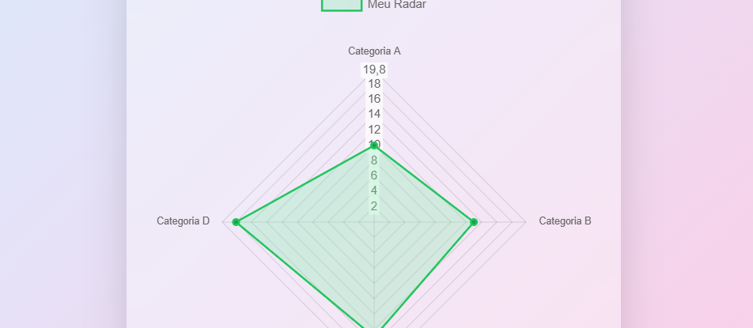

**🧐Graf**

Um aplicativo desktop para criação e exportação de gráficos do tipo radar. Permite adicionar categorias e valores personalizados, com atualização visual em tempo real e exportação do gráfico em formato .png.

💊 Gosto de fazer essas soluções rápidas quando me deparo com alguma necessidade e não quero gastar dinheiro ou me registrar em alguma plataforma. <b>Sem internet, sem cadastro, só um software não corporativista.</b> E você pode me ajudar indo lá no https://livepix.gg/caindev e dar uma forcinha e/ou ideia para um novo projeto.
